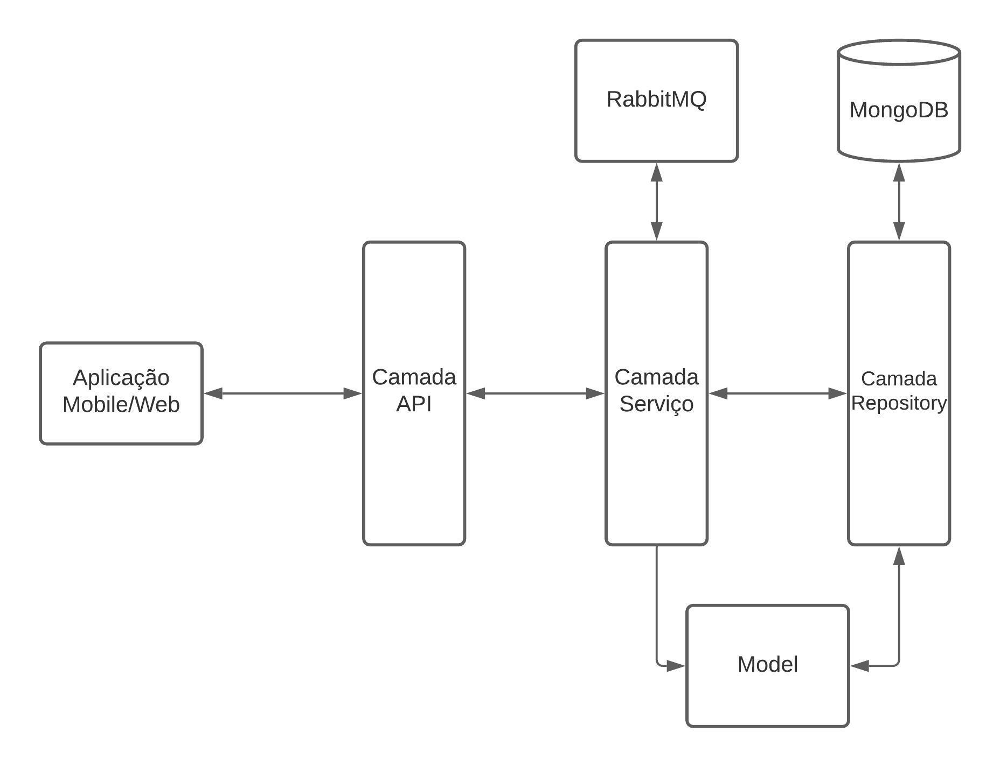

# digital-wallet

[](https://circleci.com/gh/mateusteixeira/digital-wallet/tree/main)

Projeto criado como parte de desafio técnico.

---

## Tabela de Conteúdos

- [Tecnologias utilizadas](#tecnologias-utilizadas)
- [Começando](#começando)
    - [Pré-requisitos](#Pré-requisitos)
    - [Preparando o ambiente](#Preparando-o-ambiente-para-utilização-da-aplicação)
    - [Inicialização da aplicação](#Inicialização-da-aplicação)
- [Utilizando a aplicação](#Utilizando-a-aplicação)
- [Funcionalidades](#funcionalidades)
- [Desenho da arquitetura](#Desenho-da-Arquitetura)
- [Desenvolvimento e testes](#Desenvolvimento-e-testes)
    - [Camada API](#Desenvolvimento-da-camada-API)
    - [Camada Serviço](#Desenvolvimento-da-camada-de-Serviço)
    - [Camada de Repositórios](#Desenvolvimento-da-camada-de-Repositórios)
    - [Padrões Utilizados](#Padrões-utilizados)
    - [Tratativas de erros](#Tratativas-de-erros)
    - [Testes](#Testes)
- [Autor](#autor)

---

## Tecnologias-Utilizadas

- **Java**: [11.0.12](https://www.oracle.com/java/technologies/downloads/#java11)
- **Apache Maven**: [3.6.3](https://maven.apache.org/)
- **MongoDB**: [4.4](https://www.mongodb.com/)
- **RabbitMQ**: [3](https://www.rabbitmq.com/)
- **Docker**: [20.10.18](https://www.docker.com/)
- **Docker Compose**: [1.29.2](https://docs.docker.com/compose/)
- **JUnit**: [5.7.2](https://junit.org/junit5/)
- **ArchUnit**: [0.14.1](https://www.archunit.org/)
- **Mockito**: [3.9.0](https://site.mockito.org/)
- **Spring-Boot**: [2.5.6](https://spring.io/projects/spring-boot)
    * [Lombok](https://projectlombok.org/)
    * [Test](https://docs.spring.io/spring-boot/docs/current/reference/html/boot-features-testing.html)
    * [MongoDB](https://spring.io/guides/gs/accessing-data-mongodb/)
    * [RabbitMQ](https://spring.io/guides/gs/messaging-rabbitmq/)
    * [WebMvcTest](https://docs.spring.io/spring-boot/docs/current/api/org/springframework/boot/test/autoconfigure/web/servlet/WebMvcTest.html)
- **Postman**: [8.12.14](https://www.postman.com/downloads/)
- **CircleCi**:(https://app.circleci.com/pipelines/github/mateusteixeira/digital-wallet)

---

## Começando

---

### Pré-requisitos

Para que seja possível uma correta inicialização do projeto, é necessário que estejam instalados e funcionais as
seguintes ferramentas:

- **Java SE**: O uso da linguagem Java na versão 11.
- **Maven**: Para compilação e empacotamento do projeto como um .jar.
- **Docker**: Para ser possível a criação da imagem da aplicação, assim diminuindo as ferramentas e o tempo necessário
  para o processo.
- **Docker Compose**: Para ser possível criar a imagem de todos os serviços da aplicação e para que possam ser iniciados
  estes serviços.
- **Postman**: Para ser possível realizar as requisições na aplicação.

---

### Preparando-o-ambiente-para-utilização-da-aplicação

Para realizar a compilação e empacotamento do projeto é necessário, obrigatoriamente, ter o maven e o Java já instalados
na máquina.

- [Como instalar o Java](https://www.java.com/en/download/help/index_installing.html)
- [Como instalar o Maven](https://maven.apache.org/install.html#)

Para a utilização da aplicação é necessário, obrigatoriamente, o docker/docker-compose instalado na máquina.

- [Como instalar o docker](https://docs.docker.com/install/)
- [Como instalar o docker-compose](https://docs.docker.com/compose/install/)

---

### Inicialização-da-aplicação

Na parta raiz do projeto é necessário executar a compilação e empacotamento, que pode ser feito através do comando:

```
mvn clean install
```

Ou:

```
mvn package
```

Após a compilação e empacotamento com sucesso do projeto, deverá ser executado o docker/docker-compose para que seja
construída a imagem da aplicação e iniciado os containers com a aplicação e os sistemas acessórios da aplicação
principal.

```
docker-compose up --build
```

Com o comando acima, executado na raiz do projeto, será feito a construção do arquivo docker-compose.yml, que se
encontra na raiz do projeto, e este será responsável pela inicialização de todo o ambiente.

No arquivo docker-compose.yml, encontra-se a definição das imagens que serão utilizadas e os containers que serão
construído e inicializados. Neste caso, as configurações são da aplicação em si, além da imagem do RabbitMQ, do MongoDB
e toda a configuração de porta de comunicação entre os containers e também fora do container.

## Utilizando-a-aplicação

Após inicializar os containers a aplicação ficará disponível na porta 8888 do localhost e deverá ser usada a collection
do Postman [disponível aqui](https://www.getpostman.com/collections/61d9b9ca235620d75e17)
para fazer as requisições. Na collection já esta disponível os arquivos .json necessários para as requisições, a única
alteração necessária são as atualizações dos identificadores nas requisições.

**Importante:** A aplicação, e o container do MongoDB, não tem volume persistido, portanto, ao reinicializar os
containers os dados serão perdidos

## Funcionalidades

| Funcionalidade | Descrição |
|----------------|-----------|
|CRUD de usuários| Operações padrões de CRUD para usuários da aplicação.
|CRUD de carteiras digitais|Operações padrões de CRUD para as contas digitais, possibilitando um usuário ter várias carteiras digitais.
|Operações Bancárias|Operações bancárias básicas, sendo Saque, Depósito e Pagamento de contas operações em tempo real. Transferências, como TED, DOC e PIX, são operações assíncronas.
|Extrato de operações|Disponibilização do extrato bancário de um usuário, geral ou por carteira digital.
|Extrato de erros|Disponibilização do extrato de operações do usuário que tiveram erro.

---

## Desenho-da-Arquitetura

A arquitetura pensada para aplicação é uma arquitetura simples, em que é exposta uma API para um cliente, podendo ser
mobile ou web, e esse possa consumir dos serviços disponíveis. Pode ser vista na imagem a seguir:


## Desenvolvimento-e-testes

### Desenvolvimento-da-camada-API

A camada API, também conhecida como Controller, é onde estão expostos os serviços da aplicação. Ela comunica-se
diretamente com a camada de serviço e não tem nenhum acesso ao modelo, ou base de dados, da aplicação. É composta por
classes com a nomenclatura:

- **API**: User**API**

### Desenvolvimento-da-camada-de-Serviço

A camada de serviços é a camada responsável por receber as requisições que passam pela camada de API e aplicar a regra
de negócio necessário daquele contexto. Nesta camada há a comunicação com a camada de Repositório e utilização das
classes de modelos, porém somente para uso, não podendo criar, modificar ou excluir diretamente um dado daquele modelo.

Também há a utilização de classes que fazem o papel de tradutores, entre modelo e objeto que transita para camada de
API, e utilização de classes validadoras de regras de negócio.

É composta por classes com a nomenclatura:

- **Service**: User**Service**
- **Translator**: User**Translator**
- **Validator**: User**Validator**

É na camada de Serviço também que é feita a utilização de mensageiria, nesta aplicação o RabbitMQ.

### Desenvolvimento-da-camada-de-Repositórios

A camada de repositórios é responsável única e exclusivamente pela persistência e recuperação dos dados no banco de
dados, através dos modelos. É composta por classes com a nomenclatura:

-**Repository**: User**Repository**

### Padrões-utilizados

Além do MVC, divisão da aplicação por camadas, foram utilizados outros padrões de projetos para melhor codificar a
aplicação, são eles:

- Strategy
- Builder
- Helper

Além disto, foram seguidos boas práticas de programação e aplicação de SOLID.

### Tratativas-de-erros

Foram criadas exceções customizadas para algumas regras de negócio da aplicação, estas estão contidas no package '
br/com/dwallet/exception'. Também foi criado um interceptador de exceções para que haja o retorno correto para a API na
classe br/com/dwallet/exception/DWalletExceptionHandler.java.

### Testes

O desenvolvimento da aplicação foi feito com testes unitários por camadas, utilizando-se Mockito para fazer o mock dos
serviços utilizados dentro de um serviço.

Também foi utilizado o MongoDB em memória para possibilitar o teste de integração da camada de repositório e utilizado o
WebMvnTest para a camada de API. Também possui um teste simples com o ArchUnit.

## Autor

| Autor| E-mail|
|------|-------|
|Mateus Felipe Teixeira |mateusteixeira_@hotmail.com.br |

